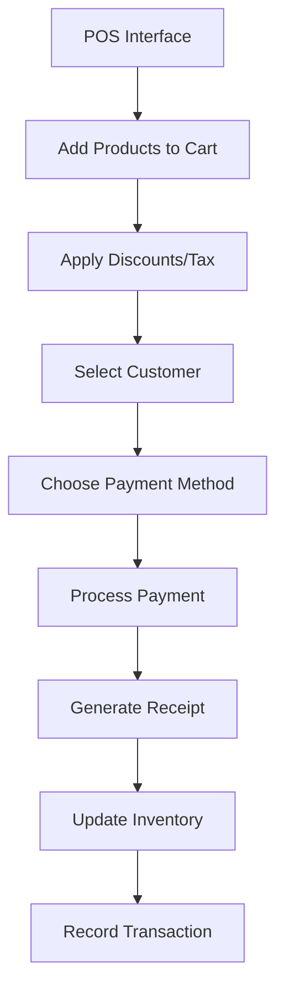
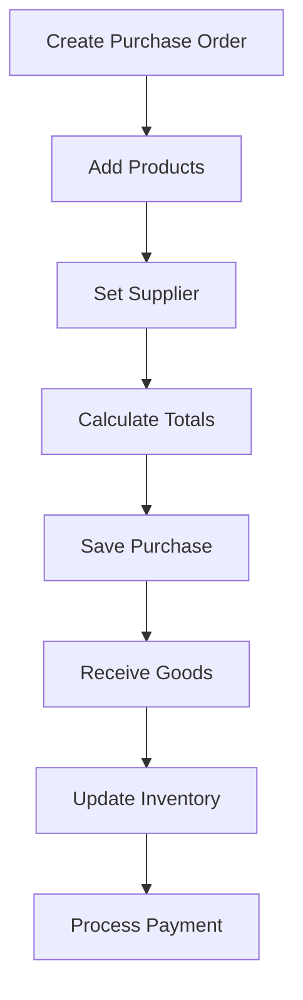
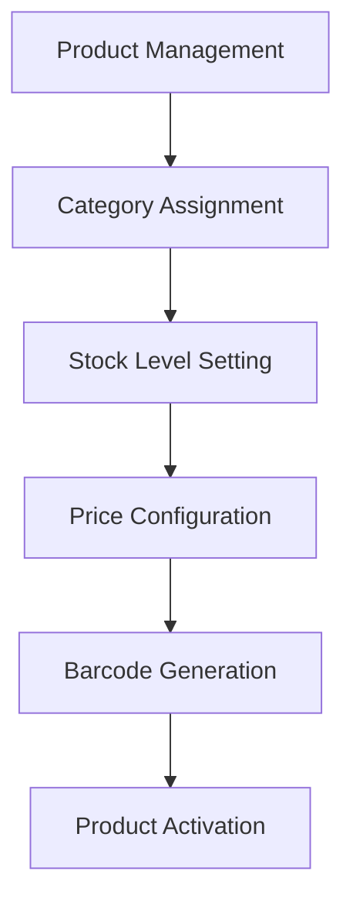

# 🏗️ Nameless.POS - Complete Architecture Documentation

## 📋 **Project Overview**
Nameless.POS adalah aplikasi Point of Sale berbasis Laravel 10 dengan arsitektur modular menggunakan nwidart/laravel-modules. Aplikasi menggunakan pattern MVC dengan tambahan Livewire untuk komponen real-time.

---

## 🗂️ **Core File Structure**

### **🔧 Core Laravel Files**
```
├── app/                           # Core application logic
├── bootstrap/                     # Application bootstrapping
├── config/                        # Configuration files
├── database/                      # Database migrations & seeders
├── public/                        # Web server document root
├── resources/                     # Views, assets, lang files
├── routes/                        # Application routes
├── storage/                       # File storage & logs
└── vendor/                        # Composer dependencies
```

### **📦 Modular Structure (Modules/)**
```
Modules/
├── Adjustment/                    # Stock adjustments
├── Currency/                      # Currency management
├── Expense/                       # Expense tracking
├── People/                        # Customers & Suppliers
├── Product/                       # Product catalog
├── Purchase/                      # Purchase orders
├── PurchasesReturn/              # Purchase returns
├── Quotation/                     # Price quotations
├── Reports/                       # Business reports
├── Sale/                          # Sales transactions
├── SalesReturn/                   # Sales returns
├── Setting/                       # System settings
├── Upload/                        # File uploads
└── User/                          # User management
```

---

## 🔗 **Module Architecture Pattern**

### **Standard Module Structure**
Each module follows consistent structure:
```
ModuleName/
├── Config/                        # Module configuration
├── Console/                       # Artisan commands
├── Database/                      # Migrations, seeders, factories
│   ├── Migrations/
│   ├── Seeders/
│   └── factories/
├── DataTables/                    # Yajra DataTable classes
├── Entities/                      # Eloquent models
├── Http/                          # Controllers, requests, middleware
│   ├── Controllers/
│   ├── Middleware/
│   └── Requests/
├── Providers/                     # Service providers
├── Resources/                     # Views, assets, translations
│   ├── views/
│   ├── assets/
│   └── lang/
├── Routes/                        # Module routes
│   ├── web.php
│   └── api.php
└── Tests/                         # Module tests
```

---

## 📊 **Database Architecture & Relationships**

### **Core Tables**
1. **users** - User authentication & profiles
2. **settings** - System configuration
3. **printer_settings** - Printer configuration
4. **user_printer_preferences** - Individual user printer settings

### **Business Logic Tables**
1. **products** - Product catalog
2. **categories** - Product categories
3. **customers** - Customer management
4. **suppliers** - Supplier management
5. **sales** - Sales transactions
6. **sale_details** - Sales line items
7. **sale_payments** - Sales payments
8. **purchases** - Purchase orders
9. **purchase_details** - Purchase line items
10. **purchase_payments** - Purchase payments

### **🔗 Key Relationships**

#### **Sales Flow:**
```
Sale (1) -> (N) SaleDetails -> (1) Product
Sale (1) -> (N) SalePayments
Sale (N) -> (1) Customer
Sale (1) -> (1) User (cashier)
```

#### **Purchase Flow:**
```
Purchase (1) -> (N) PurchaseDetails -> (1) Product
Purchase (1) -> (N) PurchasePayments
Purchase (N) -> (1) Supplier
Purchase (1) -> (1) User (buyer)
```

#### **Product Management:**
```
Product (N) -> (1) Category
Product (1) -> (N) SaleDetails
Product (1) -> (N) PurchaseDetails
```

#### **User Management:**
```
User (1) -> (1) UserPrinterPreference
User (1) -> (N) Sales (as cashier)
User (1) -> (N) Purchases (as buyer)
```

---

## 🎯 **File Relationships & Dependencies**

### **1. Core App Files**

#### **`app/Models/User.php`**
**Dependencies:**
- `Spatie\Permission\Traits\HasRoles` (roles & permissions)
- `UserPrinterPreference.php` (hasOne relationship)

**Used by:**
- All authentication controllers
- Sale/Purchase controllers (for user assignment)
- User management modules

#### **`app/Http/Controllers/HomeController.php`**
**Dependencies:**
- All module entities (for dashboard data)
- Chart.js libraries

**Used by:**
- Dashboard route (`/home`)
- Chart data API endpoints

#### **`app/Http/Controllers/PrinterSettingController.php`**
**Dependencies:**
- `PrinterSetting.php` model
- Gate permissions

**Used by:**
- Printer settings routes

### **2. Module Interdependencies**

#### **Product Module**
**Core Files:**
- `Entities/Product.php` - Main product model
- `Entities/Category.php` - Product categories
- `Controllers/ProductController.php` - CRUD operations
- `DataTables/ProductDataTable.php` - List display

**Depends on:**
- `Setting` module (for units, currency)
- `Upload` module (for product images)

**Used by:**
- `Sale` module (for sales transactions)
- `Purchase` module (for purchase orders)
- `Quotation` module (for price quotes)
- `Adjustment` module (for stock adjustments)
- `Reports` module (for product reports)

#### **Sale Module**
**Core Files:**
- `Entities/Sale.php` - Main sales model
- `Entities/SaleDetails.php` - Sales line items
- `Entities/SalePayment.php` - Payment tracking
- `Controllers/SaleController.php` - Sales CRUD
- `Controllers/PosController.php` - POS interface

**Depends on:**
- `Product` module (for products)
- `People` module (for customers)
- `User` model (for cashier)
- `Setting` module (for tax, currency)

**Used by:**
- `SalesReturn` module (for returns)
- `Reports` module (for sales reports)

#### **Reports Module**
**Core Files:**
- `Controllers/ReportsController.php` - Report generation
- `DataTables/*ReportDataTable.php` - Report tables
- `Resources/views/*` - Report views

**Depends on:**
- All transaction modules (`Sale`, `Purchase`, `SalesReturn`, `PurchasesReturn`)
- `People` module (for customer/supplier filtering)
- `Product` module (for product filtering)

---

## 🚀 **Frontend Architecture**

### **UI Framework**
- **CoreUI 3.2** - Admin dashboard framework
- **Bootstrap 4.1** - CSS framework
- **DataTables** - Table management
- **Livewire 3.0** - Real-time components
- **SweetAlert** - User notifications

### **JavaScript Dependencies**
```javascript
// Core Libraries
├── jquery                         # DOM manipulation
├── bootstrap                      # UI components
├── datatables                     # Table management
├── chart.js                       # Dashboard charts
├── livewire                       # Real-time updates
├── sweetalert2                    # Notifications
└── select2                        # Enhanced selects
```

### **Livewire Components**
```
app/Livewire/
├── ProductCart.php               # Shopping cart functionality
├── SearchProduct.php             # Product search
├── Pos/                          # Point of Sale components
│   ├── Checkout.php             # Checkout process
│   ├── Filter.php               # Product filtering
│   └── ProductList.php          # Product listing
└── Reports/                      # Report components
    ├── SalesReport.php
    ├── PurchasesReport.php
    └── ...
```

---

## 🔄 **Business Process Flow**

### **1. Sales Process**


**Files Involved:**
1. `app/Livewire/Pos/ProductList.php` - Product selection
2. `app/Livewire/ProductCart.php` - Cart management
3. `app/Livewire/Pos/Checkout.php` - Checkout process
4. `Modules/Sale/Controllers/PosController.php` - Transaction processing
5. `Modules/Sale/Entities/Sale.php` - Data persistence

### **2. Purchase Process**


**Files Involved:**
1. `Modules/Purchase/Controllers/PurchaseController.php` - Purchase CRUD
2. `Modules/Purchase/Entities/Purchase.php` - Purchase model
3. `Modules/Purchase/Entities/PurchaseDetails.php` - Purchase items
4. `Modules/Product/Entities/Product.php` - Inventory updates

### **3. Inventory Management**


**Files Involved:**
1. `Modules/Product/Controllers/ProductController.php` - Product CRUD
2. `Modules/Product/Controllers/BarcodeController.php` - Barcode generation
3. `Modules/Product/Entities/Product.php` - Product model
4. `Modules/Product/Entities/Category.php` - Category model

---

## ⚙️ **Configuration Files**

### **Module Configuration**
Each module has `module.json`:
```json
{
    "name": "ModuleName",
    "alias": "modulename",
    "description": "Module description",
    "keywords": [],
    "priority": 0,
    "providers": [
        "Modules\\ModuleName\\Providers\\ModuleNameServiceProvider"
    ],
    "aliases": {},
    "files": [],
    "requires": []
}
```

### **Key Config Files**
- `config/modules.php` - Module system configuration
- `config/datatables.php` - DataTables configuration
- `config/livewire.php` - Livewire configuration
- `config/permission.php` - Role & permission configuration

---

## 🔐 **Authentication & Authorization**

### **Permission System**
Uses Spatie Laravel Permission:
```php
// Permissions are grouped by module
'access_products', 'create_products', 'edit_products', 'delete_products'
'access_sales', 'create_sales', 'edit_sales', 'delete_sales'
'access_purchases', 'create_purchases', 'edit_purchases', 'delete_purchases'
'access_reports', 'access_settings'
```

### **Role-Based Access**
- **Admin** - Full system access
- **Manager** - Sales, purchases, reports
- **Cashier** - POS interface, basic sales
- **Owner** - Reports and analytics

---

## 🛠️ **Development Guidelines**

### **Adding New Module**
1. Generate module: `php artisan module:make ModuleName`
2. Create migrations: `php artisan module:make-migration create_table_name ModuleName`
3. Create model: `php artisan module:make-model ModelName ModuleName`
4. Create controller: `php artisan module:make-controller ControllerName ModuleName`
5. Create DataTable: `php artisan datatables:make ModuleDataTable`
6. Define routes in `Routes/web.php`
7. Create views in `Resources/views/`

### **File Naming Conventions**
- **Models**: PascalCase (`Product.php`)
- **Controllers**: PascalCase + Controller (`ProductController.php`)
- **Views**: kebab-case (`product-list.blade.php`)
- **Routes**: kebab-case (`/product-categories`)
- **Permissions**: snake_case (`access_products`)

### **Dependency Management**
Always update related modules when modifying:
- **Product changes** → Update Sale, Purchase, Reports modules
- **User changes** → Update authentication, permissions
- **Settings changes** → Update all modules that use settings

---

## 🔧 **Maintenance & Troubleshooting**

### **Common File Locations**
- **Logs**: `storage/logs/`
- **Uploads**: `storage/app/public/`
- **Cache**: `storage/framework/cache/`
- **Sessions**: `storage/framework/sessions/`
- **Config Cache**: `bootstrap/cache/`

### **Module Dependencies Check**
```bash
# Check module status
php artisan module:list

# Check module dependencies
php artisan module:use ModuleName

# Clear module cache
php artisan config:clear
php artisan cache:clear
php artisan view:clear
```

---

## 📈 **Performance Optimization**

### **Database Optimization**
- Use indexes on foreign keys
- Implement query caching for reports
- Use eager loading for relationships
- Paginate large datasets with DataTables

### **File Optimization**
- Optimize images before upload
- Use CDN for static assets
- Implement file compression
- Regular cleanup of temporary files

---

**📅 Last Updated:** November 2024  
**📝 Maintainer:** Development Team  
**🔄 Version:** 1.0.0